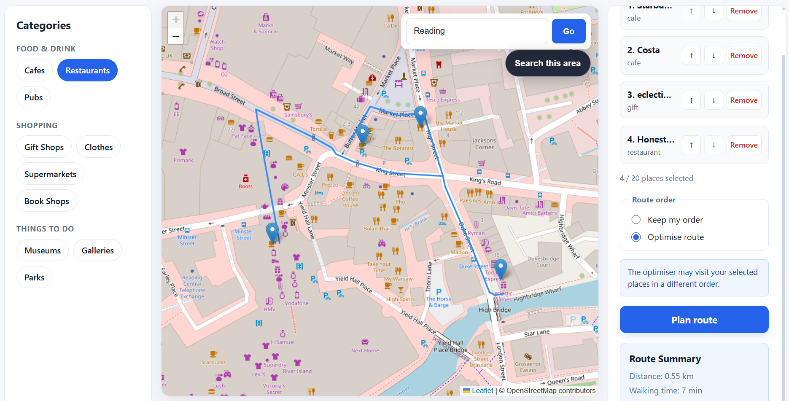

# City Explorer

City Explorer is a full-stack trip-planning application that lets users
discover points of interest in any city, build an itinerary, and generate
an optimised walking route between their selected destinations.

[Live Demo](https://city-explorer-eta-umber.vercel.app)

## Features

- Search for cities and navigate the interactive map
- Discover nearby cafes, restaurants, shops, parks, museums and other POIs
- Add and reorder destinations in a custom trip
- Generate walking routes between selected locations
- Optimise stop order using a nearest-neighbour algorithm with 2-opt improvement
- Interactive Leaflet map with route visualisation
- Responsive interface for desktop and mobile

## Demo



## Technical Highlights

City Explorer was built as a full-stack TypeScript application with a React/Vite frontend and a Node.js/Express backend. The project focuses on interactive place discovery, trip planning and route optimisation while also incorporating production-oriented practices such as runtime validation, structured logging, rate limiting, automated testing, containerisation and CI/CD.

### Full-Stack Architecture

The application uses a decoupled frontend and backend architecture:

- **React + TypeScript + Vite** for the client application
- **React Leaflet / Leaflet** for the interactive map, markers and route visualisation
- **Node.js + Express + TypeScript** for the REST API
- **Geoapify Places API** for discovering points of interest such as cafes, restaurants, shops, museums and parks
- **Geoapify Geocoding API** for converting city searches such as "York" into map coordinates
- **OpenRouteService** for walking directions and distance matrices
- **Shared TypeScript configuration/data** for categories used across the frontend and backend
- **Vercel** for frontend deployment
- **Render** for the Dockerised backend

External API keys are kept entirely on the backend through environment variables rather than being exposed to the browser.

### Route Optimisation

Users can either preserve the order in which destinations were added or allow City Explorer to optimise the trip.

Optimised routes are calculated using a combination of:

1. **OpenRouteService Distance Matrix API** to obtain travel distances between each selected location.
2. A **nearest-neighbour heuristic** to quickly construct an initial route.
3. **2-opt optimisation** to iteratively improve the route by replacing inefficient edge combinations when a shorter ordering can be found.
4. **OpenRouteService Directions API** to generate the final walking route geometry, distance and estimated duration.

This separates the optimisation algorithm from the routing provider: OpenRouteService supplies real-world walking distances, while the application determines the order in which locations should be visited.

### Runtime Input Validation

TypeScript provides compile-time type checking, but HTTP requests and third-party API responses still contain untrusted runtime data.

The backend therefore uses **Zod** to validate:

- place-search query parameters;
- latitude and longitude ranges;
- supported place categories;
- route request bodies;
- minimum and maximum trip sizes;
- individual place objects;
- responses received from external APIs.

Invalid client input is rejected with a `400 Bad Request` response before it reaches the application's core logic.

External responses are also validated before being converted into internal application objects, preventing unexpected third-party response structures from propagating through the system.

### Error Handling and API Resilience

Express routes use a shared asynchronous request wrapper and a **centralised error-handling middleware**, avoiding duplicated `try/catch` logic across individual endpoints.

Errors are translated into meaningful HTTP responses, including:

- `400` for invalid requests;
- `404` for unknown endpoints or missing resources;
- `429` when rate limits are exceeded;
- `502` when an external API is unavailable;
- `504` when an external API request times out;
- `500` for unexpected internal failures.

External HTTP requests use `AbortSignal.timeout()` so an unavailable third-party service cannot leave API requests hanging indefinitely.

The API also exposes a `/api/health` endpoint for deployment and service health checks.

### API Rate Limiting and Proxy Handling

The backend uses **express-rate-limit** to protect API endpoints from excessive requests.

A general API rate limit is applied across the service, with a stricter limit applied to route-generation requests because they depend on more expensive external routing operations.

When the backend was deployed to Render, the application was also configured to correctly trust Render's reverse proxy so Express can safely interpret forwarded client information and rate limiting can identify users correctly.

### Structured Logging

The API uses **Pino** and **pino-http** for structured request logging.

Logs include useful operational information such as:

- incoming requests;
- requested place categories;
- search bounds;
- number of places returned;
- route-planning requests;
- whether optimisation was enabled;
- optimised destination order;
- request failures and external-service errors.

Sensitive headers such as authorisation values are redacted from logs.

This logging also proved useful while diagnosing deployment-specific failures with external APIs.

### External API Migration

The original implementation used the public **OpenStreetMap Overpass API** for point-of-interest searches.

Although the implementation worked locally, the deployed Render backend experienced repeated connection refusals and timeouts when communicating with multiple public Overpass instances.

Rather than continuing to depend on an unreliable production dependency, the place-search layer was migrated to the **Geoapify Places API**.

The backend's existing `/api/places` contract was deliberately preserved during the migration, meaning the React frontend required no changes to consume the new provider.

A provider-neutral `places` service now converts Geoapify responses into the application's existing internal `Place` model.

This was an important engineering decision in the project: the external dependency changed, while the interface exposed to the rest of the application remained stable.

### City Search and Geocoding

City Explorer also supports searching directly for a city rather than manually navigating the map.

A city name is sent to a backend geocoding endpoint, which calls the **Geoapify Geocoding API** and returns validated coordinates.

The frontend then uses Leaflet's `flyTo()` functionality to smoothly reposition the map before the user searches for nearby points of interest.

Keeping geocoding behind the backend also prevents the Geoapify API key from being exposed in frontend JavaScript.

### Frontend State and UX

The React frontend manages separate state for:

- currently discovered places;
- selected trip destinations;
- route geometry;
- route summary information;
- selected place category;
- optimisation mode;
- loading states;
- API errors.

Search results and selected trip locations are combined without duplicate map markers.

Once a route is generated, non-trip search markers are hidden so the planned journey remains visually clear.

Changing the trip automatically invalidates the previously generated route, preventing stale route information from remaining visible after destinations are reordered, added or removed.

The interface also includes:

- responsive desktop, tablet and mobile layouts;
- accessible button labels and focus states;
- explicit loading and error feedback;
- a maximum trip size;
- automatic map fitting around generated routes;
- city search;
- category-based POI filtering.

### Testing

The backend includes automated tests using **Vitest** and **Supertest**.

The current suite contains **16 tests** covering both algorithmic behaviour and HTTP API behaviour.

Route optimisation tests cover:

- basic two-location routes;
- nearest-neighbour selection;
- 2-opt route improvement;
- invalid distance matrices.

API tests cover behaviour including:

- health checks;
- valid place searches;
- invalid coordinates;
- unsupported categories;
- invalid route requests;
- route generation;
- route optimisation;
- external-service failures;
- external-service timeouts;
- unknown endpoints.

External services are mocked during API tests so the test suite remains deterministic and does not depend on live third-party APIs.

### CI/CD

A **GitHub Actions** workflow runs automatically on pushes and pull requests to the main branch.

The pipeline:

1. checks out the repository;
2. installs backend dependencies using `npm ci`;
3. runs the automated Vitest/Supertest test suite;
4. verifies the backend before changes are deployed.

The frontend and backend are connected to their respective deployment platforms through Git, allowing new commits to trigger automatic deployments.

### Docker

The Express backend is containerised using **Docker** and a Node.js 24 Alpine base image.

The Docker build includes both the backend source and the repository's shared TypeScript data while keeping local environment files and dependencies outside the image.

The same containerised backend can be run locally or deployed by Render, reducing differences between development and production environments.

### Security and Configuration

Configuration and secrets are managed through environment variables, including:

```text
GEOAPIFY_API_KEY
ORS_API_KEY
FRONTEND_URL
LOG_LEVEL
```

API keys are never committed to Git or exposed in frontend source code.

CORS is restricted to the configured frontend origin rather than allowing arbitrary websites to call the API.

Request body sizes are also limited to reduce unnecessary exposure to oversized requests.
